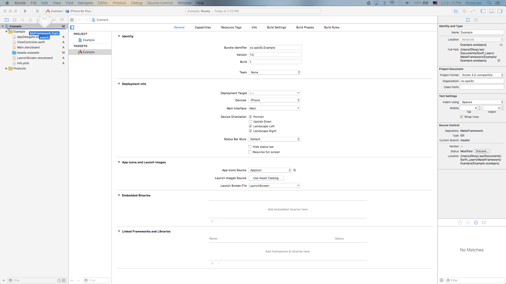

# Create Importable Framework Step by Step
1. Create a new XCode project.
    - Choose `Cocoa Touch Framework`
    - 
2. Enter framework name and choose saving path.
    -  
3. Add files.
    - 
4. Choose `Generic iOS Device` and press `Cmd+B` (build).
5. Show framework file in Finder
    - 
6. Drag the framework file to any project you'd like to use the framework.
    -  
7. In the project file, go to `General` and make sure your framework has been added to both `Embedded Binary` and `Linked Framework`.
    -  
8. Now you should be able to import your framework in the project.

# Reference

- https://medium.com/@PyBaig/build-your-own-cocoa-touch-frameworks-in-swift-d4ea3d1f9ca3#.eibxvw28a